# THE MATRIX TEAM

# Advanced Computer Lab Project

# EL7A2NI CLINIC

> This website is an integrated online medical servide consisting of a El7a2ni Pharmacy and El7a2ni Clinic. The application is built using the `MERN` stack.

<!-- TABLE OF CONTENTS -->
<details>
  <summary>Table of Contents</summary>
  <ol>
    <li><a href="#Motivation">Motivation</a></li>
    <li><a href="#Build-status">Build Status</a></li>
    <li><a href="#Code-style">Code Style</a></li>
    <li><a href="#Code-Examples">Code Examples</a></li>
    <li><a href="#screenshots">Screenshots</a></li>
    <li><a href="#Tech-used">Tech/Framework used</a></li>
    <li><a href="#Features">Features</a></li>
    <li><a href="#API-References">API References</a></li>
    <li><a href="#Installation">Installation</a></li>
    <li><a href="#How-To-Use"> How to use</a></li>
    <li><a href="#Credits">Credits And License</a></li>
  </ol>
</details>

## Motivation

This is a projected created for the GUC `CSEN7 04 Advanced Computer lab Winter 2023 Semester` it teaches students :

- The creation of a 3-tier architecture that includes frontend, backend, and database using JavaScript and JSON.
- MERN stack which is a collection of technologies that enables faster application development.
- Software development process
- Web development.

## Build Status

- This project is still under development.
- Users cannot opt into a health package.
- UX maintainance (Pop-up message from website rather than browser)

## Code Style

The code style is enforced using eslint and prettier. The code style is enforced using pre-commit hooks and pre-commit github action.

## Code Examples

```typescript
const createnotification = async (req, res) => {
  const { userid, doctorid, subject, content } = req.body;
  const user = await userModel.findOne({ _id: userid });
  const doctor = await doctorModel.findOne({ _id: doctorid });
  const username = user.Username;
  console.log(username);
  const doctorname = doctor.Username;
  console.log(doctorname);
  var status = "Active";
  if (subject === "Appointment Cancelled") {
    await notificationModel.deleteMany({
      userid: userid,
      doctorid: doctorid,
      isuser: true,
    });
    await notificationModel.deleteMany({
      userid: userid,
      doctorid: doctorid,
      isdoctor: true,
    });
    await userModel.findOneAndUpdate(
      { _id: userid },
      { WalletCredit: user.WalletCredit + doctor.SessionPrice }
    );
    const deleted = await notificationModel.findOne({
      userid: userid,
      doctorid: doctorid,
      isdoctor: true,
    });
    console.log(deleted + "e");
    status = "Cancelled";
  } else if (subject === "Followup Request") {
    status = "Pending";
  }
  const notification = await notificationModel.create({
    userid: userid,
    doctorid: doctorid,
    sender: doctorname,
    subject: subject,
    content: content + doctorname,
    isuser: true,
    Status: status,
  });
  const notification2 = await notificationModel.create({
    userid: userid,
    doctorid: doctorid,
    sender: username,
    subject: subject,
    content: content + username,
    isdoctor: true,
    Status: status,
  });
  console.log(notification);
  console.log(notification2);
  const mailOptions = {
    from: "el7a2niYaMeleegy@hotmail.com",
    to: "mazendarwish69@gmail.com",
    subject: subject,
    html: `<p>${content}</p><p style="color:tomato; font-size:25px; letter-spacing:2px;">${
      username + " & " + doctorname
    }</p>`,
  };
  await sendEmail(mailOptions);
  res.status(200).json([notification, notification2]);
};

let transporter = nodemailer.createTransport({
  host: "smtp-mail.outlook.com",
  auth: {
    user: "el7a2niYaMeleegy@hotmail.com",
    pass: "PASSWORD12345678",
  },
});

const sendEmail = async (mailOption) => {
  try {
    await transporter.sendMail(mailOption);
    return;
  } catch (error) {
    throw error;
  }
};

const addfamilymemberpatient = async (req, res) => {
  const { Username, Email, Relation } = req.body; //username of the patient and email of the patient that will be a family member to the patient that we took its username
  const familypatient = await userModel.findOne({ Email: Email }); //the patient that will be a family member

  if (familypatient) {
    const patient = await userModel.findOneAndUpdate(
      { Username: Username },
      {
        $push: {
          FamilyMembers: {
            Name: familypatient.Name,
            Age: familypatient.Age,
            Gender: familypatient.Gender,
            Relation: Relation,
          },
        },
      }
    ); //adds the familypatient to his familymembers
    console.log(patient);
    res.status(200).json(patient);
  } else {
    res.status(404).json({ error: "Patient not found" });
  }
};

const getTimeSlots = async (req, res) => {
  const { Username } = req.params;
  try {
    const doctor = await doctorModel.findOne({ Username: Username });
    await res.status(200).json(doctor.Available);
  } catch (err) {
    console.log(err);
  }
};

 const resetpassworddoctor = async (req,res) => {
    const {otpreal,otp,Username,newPassword} = req.body
    console.log(otp+"a")
    if(otp === otpreal){
      try{
        
        const updateFields = {};
      updateFields.Password = newPassword;
    
      const updated = await doctorModel.findOneAndUpdate(
      {Username: Username },
      updateFields,
      { new: true }
    );
    console.log(updated)
    if(!updated){
      throw new Error('Username not found')
    }
    else{
      res.status(200).json({docid:updated._id})
    }
      }catch(error){
        res.status(404).json({error:"Username not found"})
      }
    }
    else{
      try{
        throw new Error('Wrong OTP')
      }catch(error){
        res.status(404).json({error:"Wrong OTP"})
      }
      }
  }  

const Followup = async (req, res) => {
  const { userid, FollowUp } = req.body;
  const date = new Date(FollowUp);
  const result = await userModel.findOneAndUpdate(
    { _id: userid },
    { FollowUp: date }
  );
  console.log(result);
  res.status(200).json(result);
};

const rescheduleApp = async (req, res) => {
  const { appID, AppointmentDate, Did } = req.body;
  try {
    const app = await appointmentsModel.findOneAndUpdate(
      { _id: appID, Did },
      { AppointmentDate }
    );
    res.status(200).json(app);
  } catch {
    res.status(400).json({ Message: "Cannot Change Appointment Date" });
  }
};

const addHealthPackage = async (req, res) => {
  const { packageName } = req.body;

  try {
    // Create a new health package
    const healthPackage = await healthPackageModel.create({
      description: description,
    });

    res.status(200).json(healthPackage);
  } catch (error) {
    console.error(error);
    res.status(500).json({ error: "Internal server error." });
  }
};

const verify = async (req, res) => {
  try {
    console.log("xghs");
    let { email, otp, newPassword } = req.body;
    const otpValidity = await verifyOTP({ email, otp });
    if (otpValidity) {
      const user = Patient.findOneAndUpdate(
        { Email: email },
        { Password: newPassword }
      );

      console.log(otpValidity);
    }
    res.status(200).json({ valid: otpValidity });
  } catch (error) {
    res.status(400).send(error.message);
  }
};
```

```typescript
import React, { useState, useEffect } from "react";
import axios from "axios";
import html2canvas from "html2canvas";
import jsPDF from "jspdf";
//import Prescriptions from '../../../src/Models/Prescriptions';

const DoctorPrescriptions = () => {
  const params = new URLSearchParams(window.location.search);
  const userId = params.get("docid");
  const [prescriptions, setPrescriptions] = useState([]);
  const [loading, setLoading] = useState(true);
  const [pres, setPres] = useState(false);
  const [preid, setpreid] = useState();
  const [FormData, setFormData] = useState({
    Did: userId,
    Prescription: "",
    newPrescription: "",
  });

  useEffect(() => {
    const fetchDoctorPrescriptions = async () => {
      try {
        const response = await axios.get(
          `http://localhost:8000/viewDrPres/${userId}`
        );
        setPrescriptions(response.data);
      } catch (error) {
        console.error("Error fetching doctor prescriptions:", error);
      } finally {
        setLoading(false);
      }
    };

    fetchDoctorPrescriptions();
  }, []);

  const handleInputChange = (e) => {
    const { name, value } = e.target;
    setFormData((FormData) => ({ ...FormData, [name]: value }));
  };
  const handlePrescriptionSubmit = async (e) => {
    e.preventDefault();
    try {
      const response = await axios.put(
        "http://localhost:8000/editdrpres",
        FormData
      );
      window.alert("Prescription added:", response.data.Prescription);
      // Handle success, reset the form, or navigate to another page if needed

      setPres(false);
    } catch (error) {
      console.error("Error adding prescription:", error);
      // Handle error, show an error message to the user, etc.
    }
  };
  const handledownload = () => {
    const capture = document.querySelector(".selectedprescription");
    html2canvas(capture).then((canvas) => {
      const imgData = canvas.toDataURL("img/png");
      const doc = new jsPDF("p", "mm", "a4");
      const componentWidth = doc.internal.pageSize.getWidth();
      const componentHeight = doc.internal.pageSize.getHeight();
      doc.addImage(imgData, "PNG", 0, 0, componentWidth, componentHeight);
      doc.save("prescription.pdf");
    });
  };

  return (
    <>
      {/* Header */}
      <div
        style={{
          backgroundColor: "#4584ff",
          width: "100%",
          padding: "10px",
          display: "flex",
          alignItems: "center",
        }}
      >
        
            (window.location.href = `/homepagedoctor?docid=${userId}`)
          }
        />

        
        <h1>El7a2ni Clinic</h1>
      </div>
      {/* Page Content */}

      <div>
        <h2>Doctor Prescriptions</h2>
        {loading ? (
          <p>Loading prescriptions...</p>
        ) : (
          <ul>
            {prescriptions.map((prescription) => (
              <li className="selectedprescription" key={prescription._id}>
                <p>Patient Name : {prescription.PName}</p>
                <p>Appointment Date : {prescription.AppointmentDate}</p>
                <p>Prescription: {prescription.Prescription}</p>
                <p>Status: {prescription.Status}</p>
                <button
                  style={{ backgroundColor: "#4584ff" }}
                  onClick={handledownload}
                >
                  Download
                </button>
                <button
                  style={{ backgroundColor: "#4584ff" }}
                  type="submit"
                  name="Prescription"
                  value={prescription.Prescription}
                  onClick={() => {
                    setFormData({
                      ...FormData,
                      Prescription: prescription.Prescription,
                    });
                    setPres(true);
                    setpreid(prescription._id);
                  }}
                >
                  Edit Prescription
                </button>
                {pres && preid === prescription._id && (
                  <form onSubmit={handlePrescriptionSubmit}>
                    <label htmlFor="Prescription">Prescription:</label>
                    <textarea
                      name="newPrescription"
                      rows="4"
                      cols="50"
                      value={FormData.newPrescription}
                      onChange={handleInputChange}
                    />

                    <button
                      style={{ backgroundColor: "#4584ff" }}
                      type="submit"
                    >
                      Update Prescription
                    </button>
                  </form>
                )}
              </li>
            ))}
          </ul>
        )}
      </div>

      {/* Footer */}
      <footer
        style={{
          backgroundColor: "#4584ff",
          width: "100%",
          padding: "10px",
          display: "flex",
          alignItems: "center",
          justifyContent: "space-between",
          bottom: "1000px",
        }}
      >
        
        <p style={{ marginRight: "10px", left: "-1000px" }}>
          © el7a2ni clinics and pharmacy 2023
        </p>
      </footer>
    </>
  );
};

export default DoctorPrescriptions;
```

```typescript
import React, { useState, useEffect } from "react";

function Wallet() {
  const params = new URLSearchParams(window.location.search);
  const userId = params.get("docid");
  const userId2 = params.get("docid2");

  const [walletCredit, setWalletCredit] = useState(0);
  const [isLoading, setIsLoading] = useState(false);
  const [error, setError] = useState(null);
  const [paymentAmount, setPaymentAmount] = useState("");
  const [username, setUsername] = useState("");

  const fetchWalletCredit = () => {
    setIsLoading(true);
    fetch("/getWalletCredit", {
      method: "POST",
      headers: {
        "Content-Type": "application/json",
      },
      body: JSON.stringify({ _id: userId }),
    })
      .then((response) => response.json())
      .then((data) => {
        console.log("i am here");
        console.log(data);
        setWalletCredit(data.WalletCredit);
        setIsLoading(false);
      })
      .catch((error) => {
        setError(error.message);
        setIsLoading(false);
      });
  };

  const handlePayment = () => {
    fetch("/payWithWallet", {
      method: "POST",
      headers: {
        "Content-Type": "application/json",
      },
      body: JSON.stringify({ amount: Number(userId2), _id: userId }),
    })
      .then((response) => response.json())
      .then((data) => {
        if (data.success) {
          setWalletCredit(data.newWalletCredit);
        } else {
          setError(data.message);
        }
      })
      .catch((error) => {
        setError(error.message);
      });
  };

  if (isLoading) return <div>Loading...</div>;
  if (error) return <div>Error: {error}</div>;

  return (
    <>
      {/* Header */}
      <div
        style={{
          backgroundColor: "#4584ff",
          width: "100%",
          padding: "10px",
          display: "flex",
          alignItems: "center",
        }}
      >
        
            (window.location.href = `/payment?docid=${userId}&docid2=${userId2}`)
          }
        />
        
        <h1>El7a2ni Clinic</h1>
      </div>

      <div>
        <h2>Wallet Credit: ${walletCredit}</h2>

        <button onClick={fetchWalletCredit}>Check Wallet Credit</button>
        <p>Session Price = {userId2}</p>
        <button style={{ backgroundColor: "#4584ff" }} onClick={handlePayment}>
          Pay
        </button>
        {isLoading && <div>Loading...</div>}
        {error && <div>Error: {error}</div>}
      </div>

      {/* Page Content */}
      <div
        style={{
          backgroundImage: 'url("background.jpg")',
          backgroundSize: "cover",
          height: "500px",
        }}
      >
        {/* Add your main content here */}
      </div>

      {/* Footer */}
      <div
        style={{
          backgroundColor: "#4584ff",
          width: "100%",
          padding: "10px",
          display: "flex",
          alignItems: "center",
          justifyContent: "space-between",
        }}
      >
        
        <p style={{ marginRight: "10px", left: "-1000px" }}>
          © el7a2ni clinics and pharmacy 2023
        </p>
      </div>
    </>
  );
}

export default Wallet;
```

```typescript
import React, { useState } from "react";
//import { useHistory } from 'react-router';
//import { ImgHTMLAttributes } from 'react';
import "./theme.css";
const AdminstratorForm = () => {
  const params = new URLSearchParams(window.location.search);
  const userIdreal = params.get("docid2");
  const userId = params.get("docid");
  // const history = useHistory();

  const [formData, setFormData] = useState({
    DateOfBirth: "",
  });

  const handleChange = (event) => {
    const { name, value } = event.target;
    setFormData({ ...formData, [name]: value });
  };

  const handleSubmit = async (event) => {
    event.preventDefault();

    try {
      const date = new Date(formData.DateOfBirth);
      window.alert(date);
      const response = await fetch("http://localhost:8000/reschedule", {
        method: "PUT",
        headers: {
          "Content-Type": "application/json",
        },
        body: JSON.stringify({
          userid: userIdreal,
          docid: userId,
          DateOfBirth: date,
        }),
      });

      // Handle the response as needed
      console.log(response);
      //history.push('/filter');
      //window.location.href="http://localhost:8000/createAdminstrator"
    } catch (error) {
      console.error("Error submitting form:", error);
    }
  };

  return (
    <>
      <form onSubmit={handleSubmit}>
        <label>
          Followup:
          <input
            type="date"
            name="DateOfBirth"
            required
            value={formData.DateOfBirth}
            onChange={handleChange}
          />
        </label>
        <br />

        <button
          type="submit"
          onClick={() => window.alert("FollowUp added successufly")}
        >
          Submit
        </button>
      </form>
      </img>
    </>
  );
};

export default AdminstratorForm;
```

## Screenshots

<details>
<summary>Website Home Page</summary>
  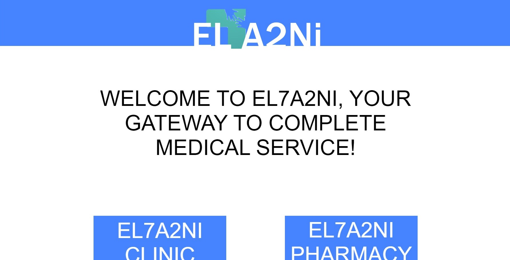
</details>
<details>
  <summary>Sign Up</summary>
  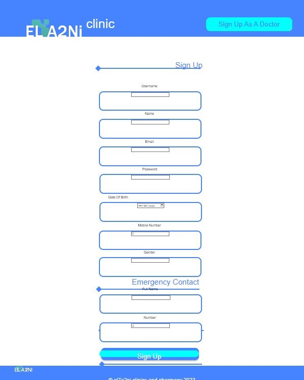
</details>
<details>
<summary>Log In</summary>
  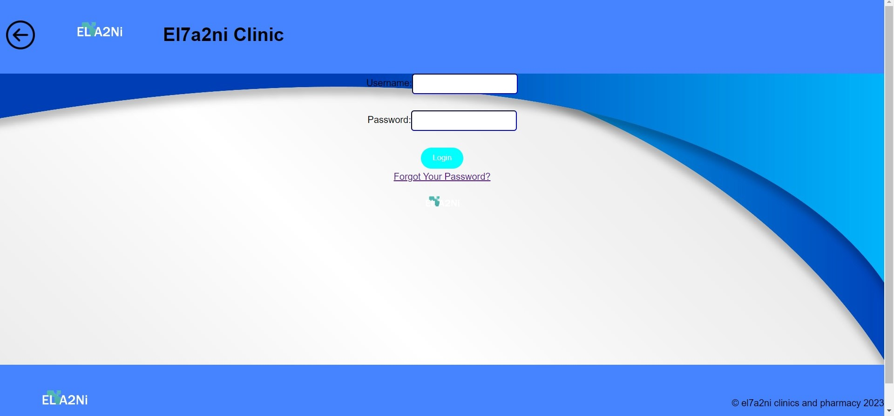
</details>
<details>
<summary>Requesting OTP (Forgot My Password)</summary>
  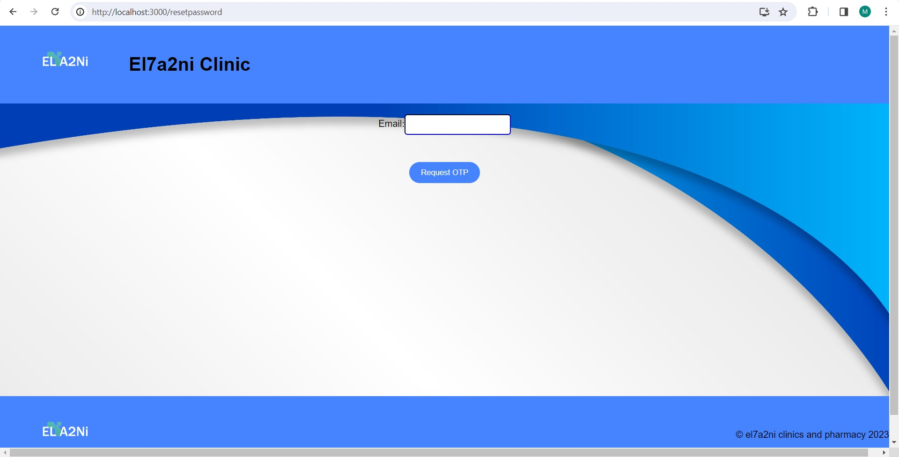
</details>
<details>
  <summary>View Prescriptions</summary>
  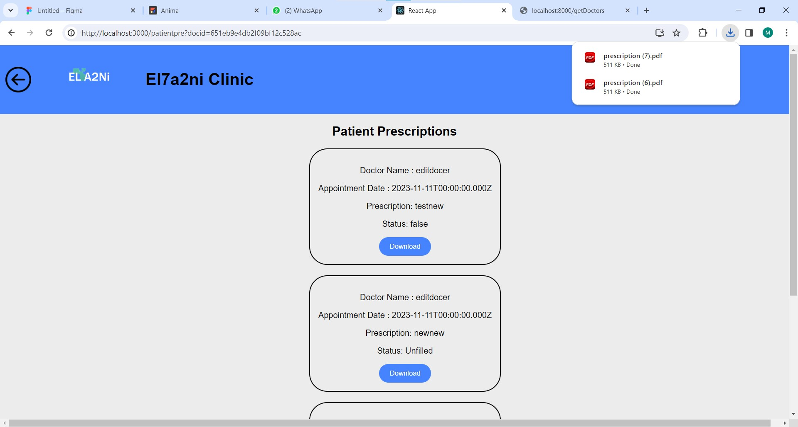
</details>
<details>
<summary>View Wallet</summary>
  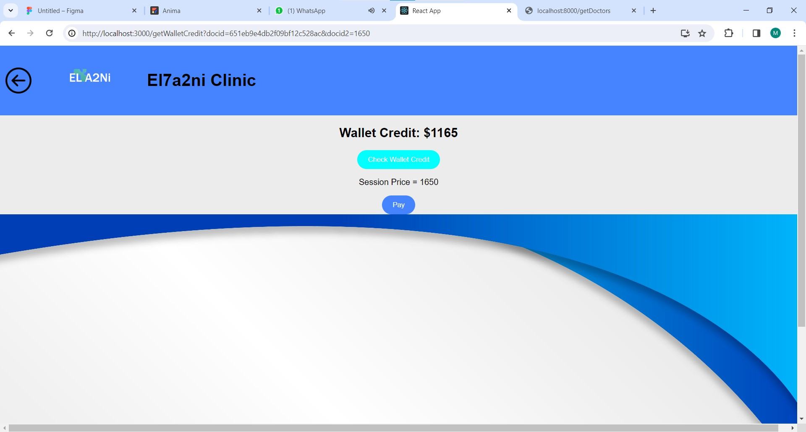
</details>
<details>
  <summary>Book An Appointment</summary>
  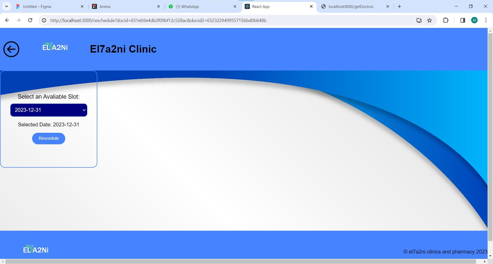
</details>
<details>
  <summary>Pay With Credit Card</summary>
  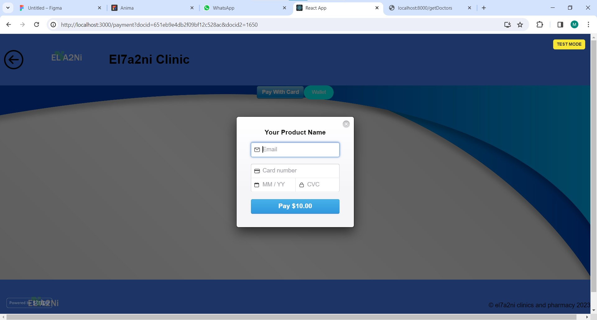
</details>
<details>
  <summary>View Doctors</summary>
  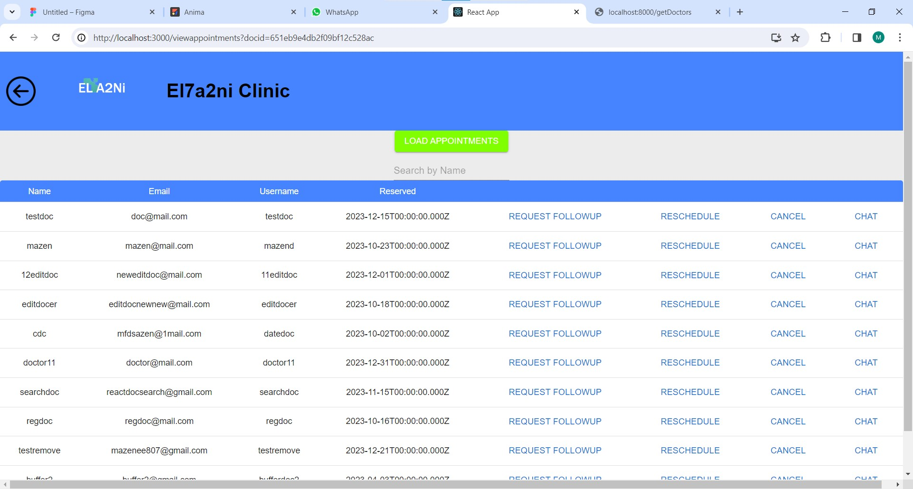
</details>
<details>
  <summary>Patient Dashboard</summary>
  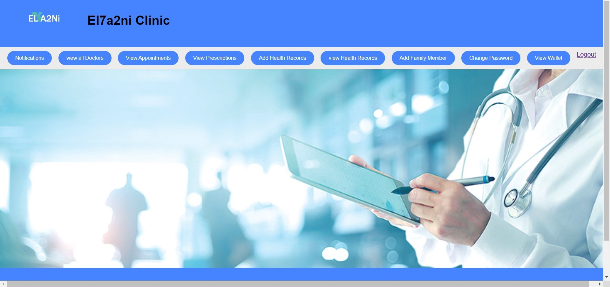
</details>
<summary>Admin Dashboard</summary>
  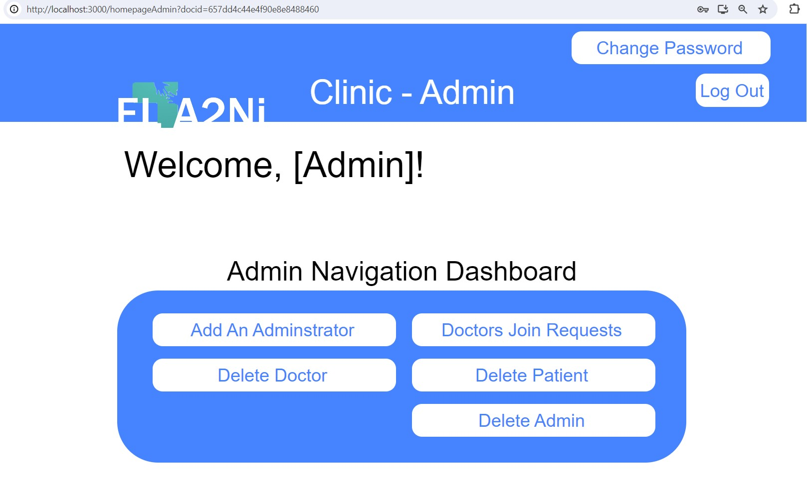
</details>
<summary>Doctor Dashboard</summary>
  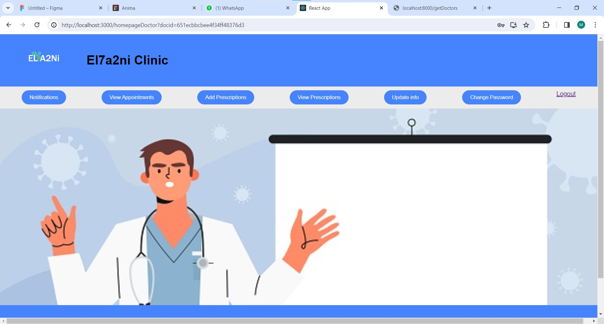
</details>

## Tech/Framework used

<a name="Tech-used"></a>

- [![Mongo][Mongo.js]][Mongo-url]
- MongoDB was used to host the database of the software. MongoDB is a NOSQL database that is easy to use and understand.

- [![Express][Express.js]][Express-url]
- Express is a back end web application framework for building RESTful APIs with Node.js, released as free and open-source software under the MIT License. It is designed for building web applications and APIs.

- [![React][React.js]][React-url]
- React is a frontend framework used to create compnents and pages that are reusable throughout the whole software.

- [![NodeJs][Node.io]][Node-url]
- Node.js is a cross-platform, open-source JavaScript runtime environment that can run on Windows, Linux, Unix, macOS, and more. Node.js runs on the V8 JavaScript engine, and executes JavaScript code outside a web browser. Node.js lets developers use JavaScript to write command line tools and for server-side scripting.

- ![Figma]
- Figma is a collaborative web application for interface design, with additional offline features enabled by desktop applications for macOS and Windows.

- [![GitHub][GitHub.io]][GitHub-url] & [Git](https://git-scm.com/)

- Github is a version control service used to save the different contributions of different team members and merge them into one branch.

* [Mongoose](https://mongoosejs.com/) is used with MongoDB to create schemas and enforce these schemas for the data entered and retrieved from the database.

* [Postman](https://www.postman.com/) is the testing software for the backend and routing of the software.
* [VSCode](https://code.visualstudio.com/) is the text editing software used to create this software and upload it to github.

## Features

This website can be accessed by admins, Doctors and Patients where each of them has different functions to access across the website. The functionality of the Clinic website is independant of the Pharmacy website, as in they have different databases to hold their information and are linked by a single welcome page for users to choose which website to access. Users are requested to log in to the website to access their functionalities.

### An Admin Can :

- Create a profile for another admin.
- Remove a doctor or patient or admin from the system.
- View all of the information uploaded by a doctor to apply to join the platform.
- Accept or reject the request of a doctor to join the platform.
- Add, update or delete health packages.
- Change password.
- Accept a request for the registration of a doctor.

### A Doctor Can:

- Change password.
- Edit and update profile details.
- View and accept the employment contract.
- Add their available time slots for appointments.
- Filter appointments by date or status.
- View information and health records of patient registered with them.
- View all prescriptions and their statuses of their patients.
- View a list of all their patients.
- Search for a patient by name.
- Filter patients based on upcoming appointments.
- Select a patient from the list of patients.
- Receive a notification of their appointment on the system and via email.
- View a list of all appointments.
- Filter appointments by date or status.
- Reschedule or cancel an appointment for a patient.
- Receive a notification that appointment is cancelled or rescheduled on the system and via email.
- Schedule a follow-up for a patient.
- Edit the prescription by adding or deleting medicine and their dosages.
- Download selected prescription (PDF).
- Add new health records for a patient.
- Start and end a video call with the patient.
- Add a prescription for a patient.
- Accept or revoke a follow-up session request from a patient.
- View the amount in my wallet.
- Chat with a patient.

### A Patient Can:

- Change their password.
- Reset password through an OTP sent to the email.
- Upload or remove documents for medical history.
- Add family members and link them to account.
- Choose to pay for Appointments using wallet credit or credit card using Stripe.
- View registered family members.
- Filter appointments by date or status.
- View uploaded health records.
- View all new and old prescriptions and their statuses.
- View health package options and details
- Subscribe to a health package for themself and their family members.
- Choose to pay for the chosen health package using wallet or credit card
- View subscribed package and the subscription status for themself and family members.
- Cancel health package subscription for themself and family members.
- View a list of all doctors along with their speciality and session price based on subscribed health package.
- Search for a doctor by name or speciality.
- Filter a doctor by speciality and/or availability on a certain date and at a specific time.
- Select a doctor from the search/filter results.
- View all details of selected doctor.
- View all available appointments of a selected doctor.
- Select an appointment date and time for themself or for a family member.
- Receive a notification of appointment on the system and via email.
- View a list of all appointments.
- Filter appointments by date or status.
- Reschedule an appointment for themself or for a family member.
- Cancel an appointment for themself or for a family member.
- Receive a notification that appointment is cancelled or rescheduled on the system and via email.
- View a list of all their perscriptions.
- Filter prescriptions based on date or doctor or filled or unfilled.
- Select a prescription from their list of perscriptions.
- View the details of the selected prescription.
- Choose to pay directly for the prescription items using wallet or credit card.
- Download selected prescription (PDF).
- Start and end a video call with the doctor.
- Request a follow-up to a previous appointment for themself or a family member.
- Receive a refund in wallet when a doctor cancels an appointment.
- View the amount in wallet.
- Chat with a doctor.

### A Guest Can :

- Sign up as a Patient
- Request to join as a doctor by submitting the required documents.

## API References:

1-User

- Route `/addUser`
  - Request Type `Post`
- Route `/addFamilyMember`
  - Request Type `Put`
- Route `/addFamilyMember`
  - Request Type `Get`
- Route `/addHealthRecords`
  - Request Type `Put`
- Route `/getDoctors`
  - Request Type `Get`
- Route `/loginuser`
  - Request Type `Post`
- Route `/changepasswordpatient`
  - Request Type `Put`
- Route `/gethealthrecords`
  - Request Type `Post`
- Route `/removehealthrecords`
  - Request Type `Put`
- Route `/addfamilymemberpatient`
  - Request Type `Post`
- Route `/getWalletCredit`
  - Request Type `Post`
- Route `/getWalletCredit`
  - Request Type `Post`
- Route `/payWithWallet`
  - Request Type `Post`
- Route `/getappointments`
  - Request Type `Post`
- Route `/createnotification`
  - Request Type `Post`
- Route `/getnotificationsuser`
  - Request Type `Post`
- Route `/viewPatPres/:Pid`
  - Request Type `get`
- Route `/reschedule`
  - Request Type `Put`
- Route `/payment`
  - Request Type `Post`
- Route `/requestOTP`
  - Request Type `Post`
- Route `/resetpasswordadmin`
  - Request Type `Put`
- Route `/reserveTimeSlot`
  - Request Type `Post`

2-Doctor

- Route `/createDoctor`
  - Request Type `Post`
- Route `/editdoctorinfo`
  - Request Type `Put`
- Route `/getappointments`
  - Request Type `Post`
- Route `/createnotification`
  - Request Type `Post`
- Route `/getnotificationsdoctor`
  - Request Type `Post`
- Route `/reschedule`
  - Request Type `Put`
- Route `/logindoctor`
  - Request Type `Post`
- Route `/changepassworddoctor`
  - Request Type `Put`
- Route `/resetpassworddoctor`
  - Request Type `Put`
- Route `/addSlots`
  - Request Type `Put`
- Route `/viewDrPres/:Did`
  - Request Type `Get`
- Route `/getDrApp/:Did`
  - Request Type `Get`
- Route `/editdrpres`
  - Request Type `Put`
- Route `/addPres`
  - Request Type `Post`
- Route `/requestOTP`
  - Request Type `Post`
- Route `/reserveTimeSlot`
  - Request Type `Post`

3-Adminstrator

- Route `/createAdminstrator`
  - Request Type `Post`
- Route `/getAdminstrators`
  - Request Type `Get`
- Route `/getDoctors`
  - Request Type `Get`
- Route `/getUsers`
  - Request Type `Get`
- Route `/deleteUser`
  - Request Type `Delete`
- Route `/deleteDoctor`
  - Request Type `Delete`
- Route `/deleteAdminstrator`
  - Request Type `Delete`
- Route `/changepasswordadmin`
  - Request Type `Put`
- Route `/acceptdoc`
  - Request Type `Post`
- Route `/reject`
  - Request Type `Delete`
- Route `/getRequests`
  - Request Type `Get`
- Route `/loginuser`
  - Request Type `Post`

4-OTP

- Route `/requestOTP`
  - Request Type `Post`

5-Prescription

- Route `/viewPatPres/:Pid`
  - Request Type `get`
- Route `/viewDrPres/:Did`
  - Request Type `get`
- Route `/editdrpres`
  - Request Type `Put`
- Route `/addPres`
  - Request Type `Post`

6-Notifications

- Route `/getappointments`
  - Request Type `Post`
- Route `/createnotification`
  - Request Type `Post`
- Route `/getnotificationsuser`
  - Request Type `Post`
- Route `/getnotificationsdoctor`
  - Request Type `Post`

5-Appointments

- Route `/reserveTimeSlot`
  - Request Type `Post`
- Route `/getDrApp/:Did`
  - Request Type `get`

### Installation

How does one go about using it?

1. Download the project.
2. Open a terminal tab in server and client folders then run

`npm i`

If there are any installation errors please run npm i [missing library] you can find all the used libraries in the package.json file.

## How to use

Run two terminals simultaneously

To run backend

- Navigate to backend/src and run :

```bash
nodemon server
```

To run frontend

- Navigate to frontend/src and run :

```bash
npm start
```

Create an env file and add links to mongodb databases and port numbers in it before running the software.

## Credits and License

- [](https://opensource.org/licenses/Apache-2.0)
- [react documentation]
- [React tutorial 1]
- [React tutorial 2]

[Express.js]: https://img.shields.io/badge/express-4A4A55?style=for-the-badge&logo=express&logoColor=FFFFFF
[Express-url]: https://expressjs.com/
[React.js]: https://img.shields.io/badge/React-20232A?style=for-the-badge&logo=react&logoColor=61DAFB
[React-url]: https://reactjs.org/
[Mongo.js]: https://img.shields.io/badge/mongo%20DB-4A4A55?style=for-the-badge&logo=mongodb&logoColor=%2049da01
[Mongo-url]: https://www.mongodb.com/
[Node.io]: https://img.shields.io/badge/node.js-6DA55F?style=for-the-badge&logo=node.js&logoColor=white
[Node-url]: https://nodejs.org/en/
[GitHub.io]: https://img.shields.io/badge/github-%23121011.svg?style=for-the-badge&logo=github&logoColor=white
[GitHub-url]: https://github.com/
[Figma]: https://img.shields.io/badge/Figma-F24E1E?style=for-the-badge&logo=figma&logoColor=white
[react documentation]: https://react.dev/learn
[React Tutorial 1]: https://www.youtube.com/watch?v=SqcY0GlETPk
[React tutorial 2]: https://www.youtube.com/watch?v=w7ejDZ8SWv8
